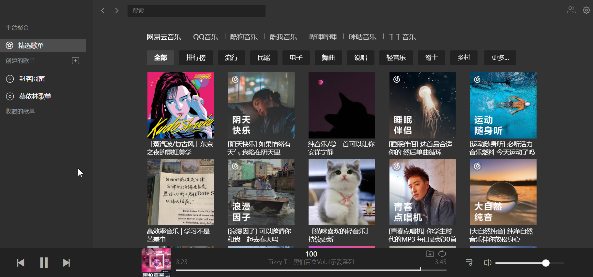
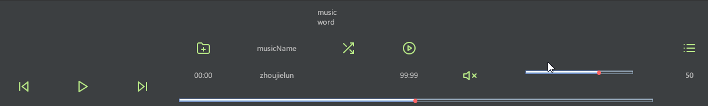

# Chinese-music
Chinese music IDEA plugin.

# 中文音乐插件
中文音乐的idea插件。

## 1. 原型
原型参考 chrome 或者 edge 浏览器插件 listen1 ， 目的是想把浏览器插件迁移到idea中。
界面如下：  

## 1. PROTOTYPE
The prototype refers to the chrome or edge browser plugin listen1 in order to migrate the browser plugin to IDEA.
The interface is as follows:

## 1. 设计
考虑到idea的插件设计和idea插件的使用习惯，因此不能直接照搬，需要做一些差异化操作。
### a. 快捷键

| 按键             | 功能     | 说明         |
|----------------|--------|------------|
| `ctrl+alt+m+p` | 播放/暂停  | 歌曲播放或者暂停播放 |
| `ctrl+alt+m+x` | 静音/恢复音量 | 歌曲播放静音控制   |
| `ctrl+alt+m+n` | 下一曲    | 下一曲        |
| `ctrl+alt+m+l` | 上一曲    | 上一曲        |
| `ctrl+alt+v+u` | 音量增加  | 音量增加       |
| `ctrl+alt+v+d` | 音量减少 | 音量减少 |

### b. 配置界面
配置各大厂商的账号密码等信息。  
### c. 主工具窗口

### d. 歌单窗口

### e. 状态栏操作
控制播放、暂停，仅此而已。  
如果没有正在播放的歌单，那么弹出歌单窗口。
### f. 数据存储
播放进度，歌单数据需要存储在本地，支持每次关闭的时候记录播放记录，下一次启动可以继续播放。  
### g. 音乐播放聚合
接入各大厂商的接口，展示歌词、作者和获取音频。
